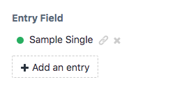

# Element Link plugin for Craft CMS 3.x

Add a link to the CP edit page for Entries, Categories, and other Elements

## Requirements

This plugin requires Craft CMS 3.0.0-beta.23 or later.

## Installation

To install the plugin, follow these instructions.

1. Open your terminal and go to your Craft project:

        cd /path/to/project

2. Then tell Composer to load the plugin:

        composer require craft-element_link/element-link

3. In the Control Panel, go to Settings → Plugins and click the “Install” button for Element Link.

or

1. Install via the Plugin Store

Brought to you by [Marion Newlevant](http://marion.newlevant.com)

Inspired in part by the [Download Assets](https://plugins.craftcms.com/download-assets) plugin.

Icon: link by Gregor Cresnar from the Noun Project
